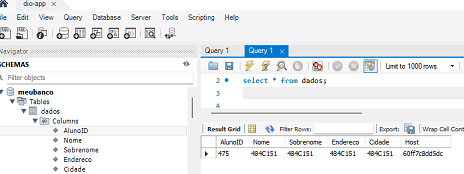

# Prática de uso do docker swarm com microsserviços

## Docker: Utilização prática no cenário de Microsserviços
## Denilson Bonatti, Instrutor - Digital Innovation One

Conteúdo do curso "Linux do Zero", da Dio.me 

### <b>Contexto:</b>  
Um supermercado decide migrar seus sistemas de gestão para a nuvem e transformar sua aplicação monolítica em microsserviços.
 

### <b>Problema:</b> 
Um hipermercado tem sua aplicação gerencial rodando num datacenter local. O custo para escalar a infraestrutura é alto. Se der um problema no hardware do datacenter, o impacto negativo nas vendas é imediato e a solução é demorada.
A empresa deseja construir mais 5 unidades. Isso implica a ampliação da infraestrutura e a criação de VPNs.
A analista de TI contratada levantou as seguintes questões:
* Dificuldades com a segurança da TI (lógica e física);
* Custo com mão de obra especializada;
* Custo de hardware;
* Custo de energia elétrica;
* Risco de falta de energia (uso de geradores);
* Despesas inesperadas.

### <b>Solução:</b> Migrar para nuvem pública e transformar a aplicação monolítica em microsserviços.
Vantagens de migrar para a nuvem pública:
* Preço (pague somente o que usar);
* Facilidade de contratação, configuração e infraestrutura;
* Escalabilidade;
* Performance. 

Para aproveitar melhor as vantagens da computação em nuvem, a aplicação monolítica será transformada em microsserviços.
Desta forma, será possível escalar os serviços de maneira independente, de acordo com a demanda de cada um.

<h3> A figura abaixo ilustra a diferença entre aplicações monolíticas e microsserviços:</h3> 

 <i>Fonte: https://medium.com/tecnologia-e-afins/que-raios-s%C3%A3o-microsservi%C3%A7os-e4aa96599284</i>

## CLUSTER:
Vamos usar um cluster, ou seja, um conjunto de máquinas que trabalham em conjunto, funcionando como um único sistema. Essas máquinas executam a mesma tarefa e cada uma delas é chamada de NÓ (node). Faremos isso para potencializar o desempenho e aumentar a disponibilidade da aplicação.
Neste exercício, será utilizado o Docker Swarm, que faz a orquestração e o agendamento de cargas de trabalho de containers Docker. A aplicação vai rodar em um cluster "Swarm".
Se um dos nós tiver um problema de hardware e parar de funcionar, o Docker Swarm automaticamente realoca o containers nos outros nós do cluster.

## AWS:
* VPC e instâncias EC2 criadas com o Terraform.
* Veja os passos em: [Passos para criação do ambiente com Terraform](./terraform/tfREADME.md)
  
## Conectar na instância via SSH:

> ssh -i "dio-app-key" ec2-user@IP.EXTERNO.DA.INSTANCIA   

## Instalar o docker nos nós do cluster:
* Atualizar o linux: sudo yum update
* Instalar o docker: sudo yum install docker
* Iniciar o docker deamon: sudo systemctl start docker

## Clonar o repositório da aplicação para a instância 0:
* instalar o git:
> yum install git 
* fazer o clone (na pasta /home/ec2-user):
> git clone https://github.com/denilsonbonatti/toshiro-shibakita.git

## Criar a imagem para o container MySQL com o script SQL "banco.sql":
* Veja a preparação do container do banco de dados em: [dbREADME.md](db/dbREADME.md)

## Criação do container da aplicação em PHP:
* Copiar arquivo index.php para a pasta local (na instância 0): /data/app
* Editar o arquivo index.php para inserir o IP externo do servidor do banco de dados
* Criar o container da aplicação com o comando:
> docker run --name web-dio-app -dt -p 80:80 -v /data/app:/app/ webdevops/php-apache:alpine-php7
* Container criado:

CONTAINER ID  | IMAGE  |    COMMAND    |   CREATED   |  STATUS | PORTS  |  NAMES
--------------|--------|---------------|-------------|---------|--------|--------
60ff7c8dd5dc |  webdevops/php-apache:alpine-php7 |  "/entrypoint supervi…" |  3 minutes ago |   Up 3 minutes      |        443/tcp, 0.0.0.0:80->80/tcp, :::80->80/tcp, 9000/tcp     |    web-dio-app

## Teste da aplicação:
* Inserir o IP externo do servidor no browser de qualquer computador com acesso à internet. Como a porta 80 já está aberta no Security Group e é a porta padrão HTTP, o browser irá abrir o arquivo index.php.
* Funcionou, porém exibiu as seguintes mensagens de erro:
> Warning: mysqli::__construct(): The server requested authentication method unknown to the client caching_sha2_password in /app/index.php on line 24
> Warning: mysqli::__construct(): (HY000/2054): The server requested authentication method unknown to the client in /app/index.php on line 24 Connect failed: The server requested authentication method unknown to the client
* Pesquisando este erro na internet, vi que várias pessoas resolveram usando o comando (dentro do mysql, com a senha do root):
> ALTER USER 'root'@'localhost' IDENTIFIED WITH mysql_native_password BY '123456'; 
* Porém, quando faço isso, há o erro:
> ERROR 1396 (HY000): Operation ALTER USER failed for 'root'@'localhost'
* Pesquisando mais, vi que o root deve ser usado para 'todos', da seguinte forma:
> ALTER USER 'root'@'%' IDENTIFIED WITH mysql_native_password BY '12345';
* Funcionou!

* É possível ver o registro adicionado através do Workbench:

