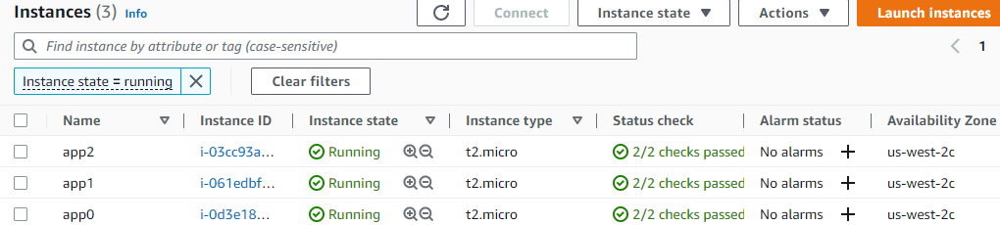
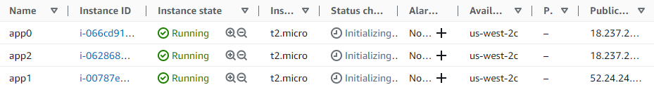
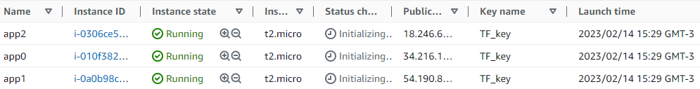

# Prática de uso do docker swarm com microsserviços

## Docker: Utilização prática no cenário de Microsserviços
## Denilson Bonatti, Instrutor - Digital Innovation One

Conteúdo do curso "Linux do Zero", da Dio.me 

### <b>Contexto:</b>  
Um supermercado decide migrar seus sistemas de gestão para a nuvem e transformar sua aplicação monolítica em microsserviços.
 

### <b>Problema:</b> 
Um hipermercado tem sua aplicação gerencial rodando num datacenter local. O custo para escalar a infraestrutura é alto. Se der um problema no hardware do datacenter, o impacto negativo nas vendas é imediato e a solução é demorada.
A empresa deseja construir mais 5 unidades. Isso implica a ampliação da infraestrutura e a criação de VPNs.
A analista de TI contratada levantou as seguintes questões:
* Dificuldades com a segurança da TI (lógica e física);
* Custo com mão de obra especializada;
* Custo de hardware;
* Custo de energia elétrica;
* Risco de falta de energia (uso de geradores);
* Despesas inesperadas.

### <b>Solução:</b> Migrar para nuvem pública e transformar a aplicação monolítica em microsserviços.
Vantagens de migrar para a nuvem pública:
* Preço (pague somente o que usar);
* Facilidade de contratação, configuração e infraestrutura;
* Escalabilidade;
* Performance. 

Para aproveitar melhor as vantagens da computação em nuvem, a aplicação monolítica será transformada em microsserviços.
Desta forma, será possível escalar os serviços de maneira independente, de acordo com a demanda de cada um.

<h3> A figura abaixo ilustra a diferença entre aplicações monolíticas e microsserviços:</h3> 

 <i>Fonte: https://medium.com/tecnologia-e-afins/que-raios-s%C3%A3o-microsservi%C3%A7os-e4aa96599284</i>

## CLUSTER:
Vamos usar um cluster, ou seja, um conjunto de máquinas que trabalham em conjunto, funcionando como um único sistema. Essas máquinas executam a mesma tarefa e cada uma delas é chamada de NÓ (node). Faremos isso para potencializar o desempenho e aumentar a disponibilidade da aplicação.
Neste exercício, será utilizado o Docker Swarm, que faz a orquestração e o agendamento de cargas de trabalho de containers Docker. A aplicação vai rodar em um cluster "Swarm".
Se um dos nós tiver um problema de hardware e parar de funcionar, o Docker Swarm automaticamente realoca o containers nos outros nós do cluster.

## AWS:
Três instâncias EC2 (t2.micro) com Ubuntu Server. Todas "free tier eligible". 
Criação de um par de chaves (nome: aws-keys) RSA para acessar remotamente as máquinas. 
Rede:  
* VPC: padrão (10.0.0.0/24) - minha-rede
* Subnet: padrão (10.0.0.0/24) - minha-subrede
* Não atribui automaticamente IP público
* Firewall (security group): launch-wizard-1
  
## Usando Terraform para criar as VMs
### Criar usuário no AWS IAM:
1. Criar usuário no IAM com permissão "Programmatic access";
2. Adicionar políticas de acesso diretamente ao usuário, para este exercício;
3.  Selecionar a política "AmazonEC2FullAccess";
4.  Gerar uma chave de acesso e salvar o arquivo no computador;
### Preparar o ambiente:
1. Instalar o AWS CLI;
2. Baixar o Terraform no site https://developer.hashicorp.com/terraform/downloads ;
3. Extrair o arquivo;
4. Criar uma pasta "C:\Program Files (x86)\Terraform" ;
5. Copiar o arquivo terraform.exe para a pasta criada;
6. Incluir o caminho dessa pasta na variável de ambiente PATH do Windows;
7. Configurar o AWS CLI (comando aws configure) com a chave de acesso criada;
### Testar o Terraform
1. Criar uma pasta de teste;
2. Criar um arquivo main.tf (ver conteúdo de exemplo em https://developer.hashicorp.com/terraform/tutorials/aws-get-started/aws-build)
3. Executar o comando:
> terraform init
4. Para formatar corretamente o arquivo, use o comando:
> terraform fmt
5. Para validar a sintaxe do arquivo, use o comando:
> terraform validate
6. Para criar os recursos, use o comando:
> terraform apply
[ No meu caso, deu o seguinte erro:  creating EC2 Instance: VPCIdNotSpecified: No default VPC for this user. GroupName is only supported for EC2-Classic and default VPC.]
* Correção do erro:
  * Adicionei as linhas:
    * vpc_security_group_ids = ["sg-...."]
    * subnet_id = "s..."
  * Rodei novamente o terraform apply e deu a mensagem de sucesso: aws_instance.app_server: Creation complete after 44s [id=i-0a3626191a421e3b3] 
Visualização da vm criada no dashboard da AWS:
 

### Usar o Terraform para criar as três instâncias EC2 que serão usadas como nós do cluster:
Alterei o arquivo main.tf para criar três instâncias de máquinas t2.micro. 
Para isso, foi incluída a linha "count = 3" e alterei o código para atribuir tags de acordo com o número da máquina.
> resource "aws_instance" "app" { 
>  <b>count                  = 3</b> 
>  ami                    = "ami-830c94e3" 
>  instance_type          = "t2.micro" 
>  vpc_security_group_ids = ["sg-0b..."] 
>  subnet_id              = "subnet-0d..." 
> 
> <b> tags = { 
>    Name = "app${count.index}"</b> 
>  } 
>} 

 

### Imagem das instâncias criadas na AWS:

 

### Problema na criação das instâncias: faltou criar chaves de acesso.
* destruir as instâncias e criar novamente com chave de acesso configurada
* incluir a linha: "associate_public_ip_address = true", para que seja atribuído um IP público a cada instância, de modo que elas sejam acessíveis por SSH
* Funcionou:

### Código incluído no arquivo main.tf para que as instâncias sejam criadas com IP público e associadas a um par de chaves:

### Instâncias criadas com este código:

Não estou conseguindo acessar as instâncias por SSH. O erro é connection time out. 
Criar uma bastion host com IP público e as outras máquinas com IP privado. Testar.
Alterações realizadas:
* criei mais uma instância EC2 para funcionar como bastion host, com IP público
* retirei a linha de atribuição de IP público para as outras instâncias, que farão parte do cluster
Ainda com erro. Usei o terraform destroy.
Vou criar um main.tf que faça a configuração completa, incluindo rede e grupo de segurança.
* Isso pode ter algo a ver com as credenciais de acesso do IAM user? Me parece que não, porque isso causaria o não funcionamento da criação das instâncias. As instâncias foram criadas, mas não consegui acessar por SSH. Pode ser algum erro na configuração do grupo de segurança, ou faltou configurar corretamente o firewall.
* 
