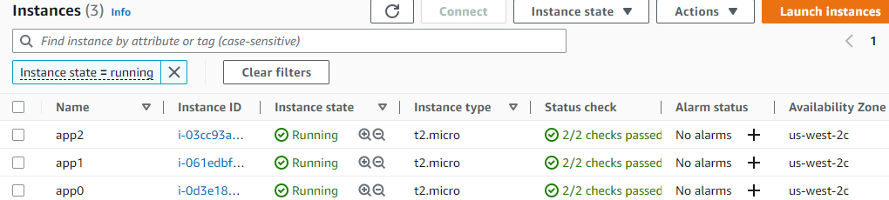
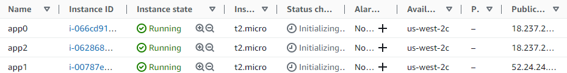
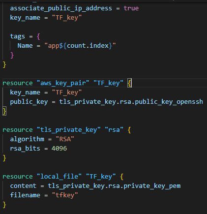
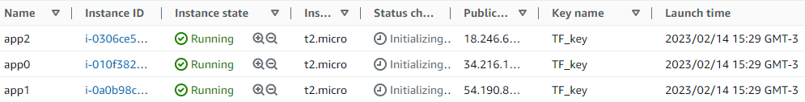

## Usando Terraform para criar as VMs
### Criar usuário no AWS IAM:
1. Criar usuário no IAM com permissão "Programmatic access";
2. Adicionar políticas de acesso diretamente ao usuário, para este exercício;
3.  Selecionar a política "AmazonEC2FullAccess";
4.  Gerar uma chave de acesso e salvar o arquivo no computador;
### Preparar o ambiente:
1. Instalar o AWS CLI;
2. Baixar o Terraform no site https://developer.hashicorp.com/terraform/downloads ;
3. Extrair o arquivo;
4. Criar uma pasta "C:\Program Files (x86)\Terraform" ;
5. Copiar o arquivo terraform.exe para a pasta criada;
6. Incluir o caminho dessa pasta na variável de ambiente PATH do Windows;
7. Configurar o AWS CLI (comando aws configure) com a chave de acesso criada;
### Testar o Terraform
1. Criar uma pasta de teste;
2. Criar um arquivo main.tf (ver conteúdo de exemplo em https://developer.hashicorp.com/terraform/tutorials/aws-get-started/aws-build)
3. Executar o comando:
> terraform init
4. Para formatar corretamente o arquivo, use o comando:
> terraform fmt
5. Para validar a sintaxe do arquivo, use o comando:
> terraform validate
6. Para criar os recursos, use o comando:
> terraform apply
[ No meu caso, deu o seguinte erro:  creating EC2 Instance: VPCIdNotSpecified: No default VPC for this user. GroupName is only supported for EC2-Classic and default VPC.]
* Correção do erro:
  * Adicionei as linhas:
    * vpc_security_group_ids = ["sg-...."]
    * subnet_id = "s..."
  * Rodei novamente o terraform apply e deu a mensagem de sucesso: aws_instance.app_server: Creation complete after 44s [id=i-0a3626191a421e3b3] 
Visualização da vm criada no dashboard da AWS:
 

### Usar o Terraform para criar as três instâncias EC2 que serão usadas como nós do cluster:
Alterei o arquivo main.tf para criar três instâncias de máquinas t2.micro. 
Para isso, foi incluída a linha "count = 3" e alterei o código para atribuir tags de acordo com o número da máquina.
> resource "aws_instance" "app" { 
>  <b>count                  = 3</b> 
>  ami                    = "ami-830c94e3" 
>  instance_type          = "t2.micro" 
>  vpc_security_group_ids = ["sg-0b..."] 
>  subnet_id              = "subnet-0d..." 
> 
> <b> tags = { 
>    Name = "app${count.index}"</b> 
>  } 
>} 

 

### Imagem das instâncias criadas na AWS:

 

### Problema na criação das instâncias: faltou criar chaves de acesso.
* destruir as instâncias e criar novamente com chave de acesso configurada
* incluir a linha: "associate_public_ip_address = true", para que seja atribuído um IP público a cada instância, de modo que elas sejam acessíveis por SSH
* Funcionou:

### Código incluído no arquivo main.tf para que as instâncias sejam criadas com IP público e associadas a um par de chaves:

### Instâncias criadas com este código:

## Utilização de módulos do Terraform

* Estudando mais sobre o Terraform, decidi utilizar os módulos para criação do ambiente.
* Depois de criar o arquivo "variable.tf" e modificar o arquivo "main.tf", rodei novamente o comando "terraform init", para carregar os módulos e fiz o "apply".
* Resultado:

## Problema de acesso via SSH 
* Ainda não consigo acessar, dá "time out".
* Vou verificar as permissões no security group.